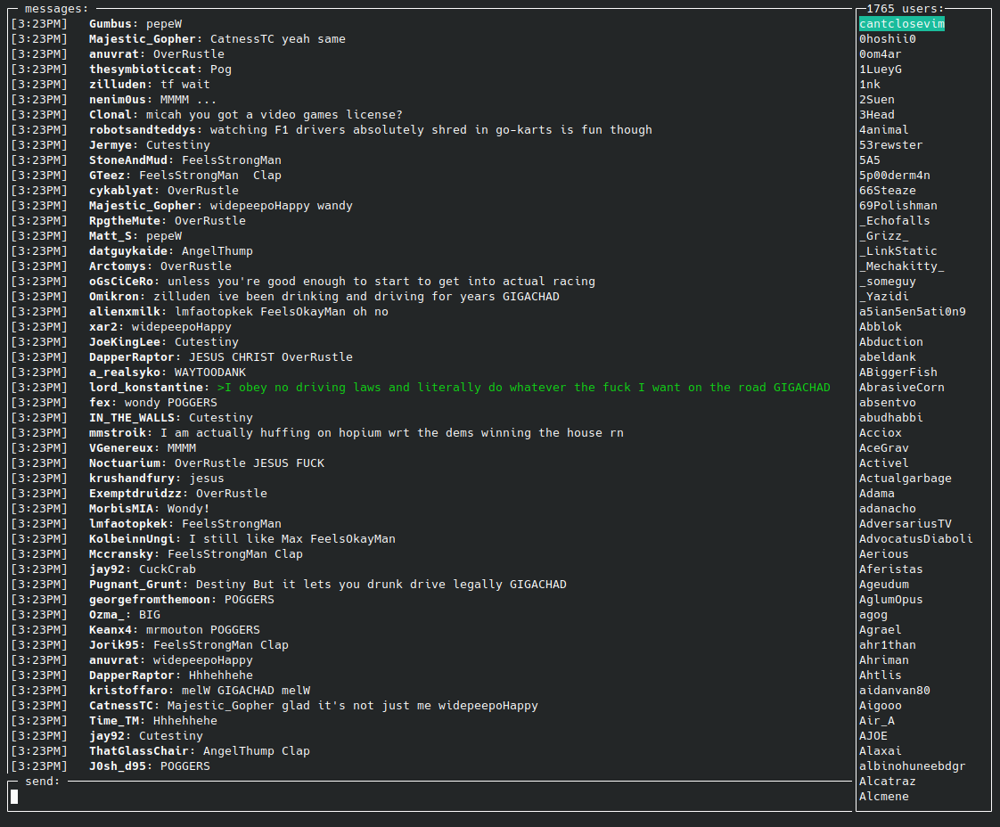

# tdgg
Destiny.gg chat in the terminal

Original code from: https://github.com/MemeLabs/tsgg

`cp sample-config.toml config.toml`

`go build`

`./tdgg`

Command line flags:

`--config` <u>path</u>

`--chat` dgg|ogg|sgg